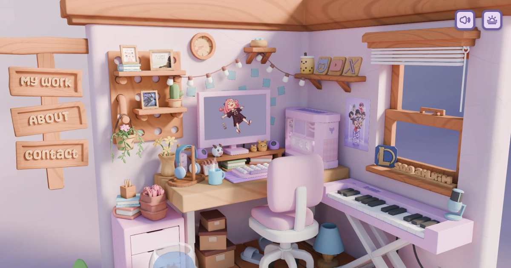

# 小耳 Jane · 3D 作品集 v2 · 甜室版

**作品集系列第二件**——一个粉嫩 kawaii 的 3D 房间，可以**鼠标拖拽 360° 探索**，**点击房间里的木牌**进入弹窗看作品。

基于 Andrew Woan 与 Soo-ah Kim 的 Sooah's Room Folio 中文化定制，保留全部交互精华（拖拽视角 / 弹窗模态 / 背景音效 / 亮暗主题切换）。



## 这个版本是什么

- **内容**：小耳 Jane 的真实身份、25 年职业历程、3 件代表作品（《方程之舞》/ 武隆懒坝大地艺术节 / AI Vibe Coding 工具集）
- **联系方式**：4 个图标连接到 X / 公众号 / 个人网站 / 小红书
- **3D 房间**：完整保留 Andrew + Soo-ah 共同创作的甜室原作（Kirby、动画屏幕、boba 装饰、可弹的钢琴、所有韩文小细节）作为致敬
- **木牌**：保留原作 My Work / About / Contact 英文签名作为对原作者的致敬
- **字体策略**：Motley Forces / Shifty Notes（拉丁字符）+ 苹方 SC / 微软雅黑 / Hiragino Sans GB（中文字符）系统字体链
- **主题切换**：原版的亮 / 暗双主题保留

## 作品集系列规划

| 版本 | 状态 | 3D 场景 | 交互模式 |
|------|------|---------|---------|
| **v1 · Abigail 房间** ([repo](https://github.com/Jane-xiaoer/xiaoer-3d-portfolio-abigail)) | 🟢 已发布 | 暖米色少女房间 | 滚动驱动（GSAP ScrollTrigger） |
| **v2 · 甜室**（本仓库） | 🟢 已发布 | 粉嫩 kawaii 房间 + 池塘 | **拖拽探索 + 弹窗** |
| **v3 · 东京街景** | 📌 计划中 | LittlestTokyo diorama | 滚动驱动 |

## 本地运行

需要 Node.js 24+：

```bash
nvm use 24
npm install
npm run dev
```

访问 http://localhost:5173/。

进入后：
- **左键拖动** = 旋转视角
- **滚轮** = 缩放
- **点击木牌**（My Work / About / Contact）= 弹出对应作品集 / 关于 / 联系

## 致谢

这个版本之所以存在，是因为下面这些人创造了它的灵魂：

- **🌸 [Soo-ah Kim](https://github.com/sooahkim)**：3D 房间设计 + 美术方向（首尔大学计算机+音乐双修学生）
- **🛠️ [Andrew Woan](https://github.com/andrewwoan)**：[原始工程代码](https://github.com/andrewwoan/sooahs-room-folio)（MIT 开源）+ Three.js + Blender 教程作者
- **🎨 [bokoko33](https://bokoko33.me/)**：3D 滚动作品集设计开山者，整个 3D 作品集潮流的源头
- **🎵 Cosmic Star Candy** by Daystar Project：原版背景音乐
- **💡 灵感来源**：Bruno Simon、Rachel Wei、Denis Wipart、Nicky Blender 的作品

## 我做了什么

- 将 index.html 全部内容本地化为中文（loading 屏 / 三个 modal 弹窗 / og 信息）
- 替换 main.js 中所有动态生成的英文文字（Loading 按钮、静音按钮、欢迎语）
- 4 个联系图标重设计：X / 公众号 / 个人网站 / 小红书（替换原版 Email / GitHub / LinkedIn / Instagram）
- style.scss 字体策略调整为中文友好（Motley Forces / Shifty Notes + 苹方 / 雅黑 后备）
- 3D 模型本体不动（保留全部原作美学和交互逻辑）

## 许可证

代码和素材继承 [Andrew Woan 项目的 MIT 许可证](LICENSE.md)。本地化与文案修改部分以同样 MIT 协议开源。

---

**作者**：小耳 Jane · [xiaoer-art.com](https://xiaoer-art.com)
**联系**：[X @xiaoezhan](https://x.com/xiaoezhan) · [Ears 公众号](https://mp.weixin.qq.com/s/q4DwpS43VaOhPP7jyFC8dw) · 小红书 621994108
